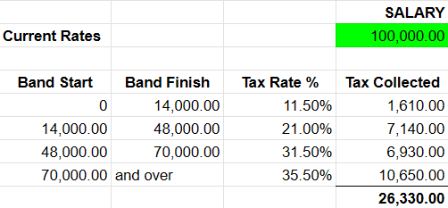

# TaxLab.FrontEndTest.2025

This test is designed to evaluate your ability to design, implement and maintain a modern web application.

## Introduction

Your task is to create a tool that can calculate tax to pay based on a provided salary.  The tax bands to use to perform
this calculation are provided in `income-tax-bands.json`.

An example of this calculation is given below:

Context around this task is intentionally vague so we can see what direction you take this on your own.  With that
said, feel free to reach out with clarifying questions.  Please spend no more than 2 hours on this test.

## Key Requirements

- Please build this solution as a React SPA.

- Please include and query `income-tax-bands.json` as if it was an API endpoint that you are requesting data from.

- Please do not include any actual server-side interaction or rendering.

- External libraries and packages are encouraged.

## Evaluation

You will be evaluated on your design and styling, the decisions you made during implementation, and the overall user
experience of what you have built.
